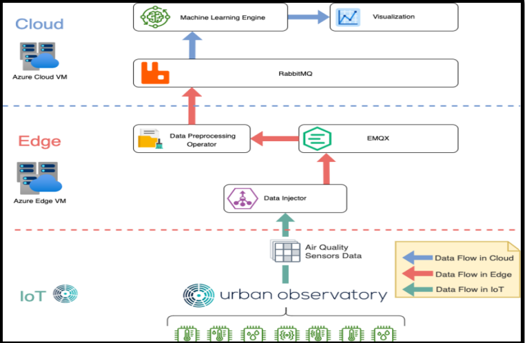

# IoT-Edge-Cloud-Data-Pipeline

## Introduction

This project demonstrates a complete IoT data processing pipeline, from sensor data collection to cloud-based machine learning prediction. The system gathers data from IoT sensors, processes and cleanses it at the edge layer(Edge Computing), and then sends it to the cloud for visualization and predictive analysis using machine learning.

### Key Features
- **Data Flow**: Data flows across three layers: IoT, Edge, and Cloud.
- **MQTT & AMQP Protocols**: Utilizes MQTT (via EMQX) and AMQP (via RabbitMQ) protocols for efficient message handling between layers.
- **Edge Processing**: Implements real-time data preprocessing, outlier removal, and daily averages at the edge.
- **Cloud Prediction**: Data visualization and prediction for future trends using a machine learning model.
- **Dockerized Environment**: Deploys all components using Docker and Docker Compose for easy scalability and replication.

## Architecture Overview



1. **IoT Layer**: IoT sensors collect air quality data (PM2.5) and store it in the Newcastle Urban Observatory.
2. **Edge Layer**: 
   - **Task 1**: Collects sensor data and publishes it via MQTT using EMQX Docker image.
   - **Task 2**: Preprocesses the data (outlier removal, daily average) and sends it to the cloud using RabbitMQ.
3. **Cloud Layer**: 
   - **Task 3**: Visualizes the preprocessed data and predicts future values using a machine learning model (Prophet).

## Installation

### Requirements
- **Ubuntu Virtual Machines**: Two VMs are required—one for the edge layer and one for the cloud layer.
- **Python**: Ensure Python3, pip, and docker-compose are installed on both VMs.
- **Docker**: Install Docker on both VMs using the following commands:
  ```bash
  sudo apt install docker docker-compose
  ```

### Dependencies
- Install necessary dependencies on the edge and cloud layers:
  ```bash
  pip install requests paho-mqtt pika matplotlib plotly pandas prophet
  ```

### Setting Up Docker Images
- **Edge Layer**:
  - Pull and run the EMQX and RabbitMQ Docker images:
    ```bash
    docker run -d -p 1883:1883 emqx/emqx
    docker run -d -p 5672:5672 rabbitmq
    ```
- **Cloud Layer**:
  - Pull and run the RabbitMQ Docker image:
    ```bash
    docker run -d -p 5672:5672 rabbitmq
    ```

## Running the Application

1. **Task 1: Data Injector**:
   - Install the required dependencies:
     ```bash
     pip install requests paho-mqtt
     ```
   - Run the data injector code to fetch data from the Newcastle Urban Observatory and publish it via MQTT.
   

2. **Task 2: Data Preprocessing**:
   - Install the required dependencies:
     ```bash
     pip install pika
     ```
   - Subscribe to the MQTT data, preprocess it (remove outliers, calculate daily averages), and send it to the cloud using RabbitMQ.


3. **Task 3: Data Prediction and Visualization**:
   - Install the machine learning dependencies:
     ```bash
     pip install prophet matplotlib pandas plotly
     ```
   - Consume the preprocessed data from RabbitMQ, visualize the historical data, and predict the next 15 days using Prophet.


## Docker Files
- **Dockerfile**: Used to build a Docker image for the data preprocessing operator.
- **docker-compose.yml**: Defines the services required for running the edge and cloud components.

## Results and Discussion

The data visualization revealed trends in PM2.5 levels over the months of June and July, with occasional spikes due to external factors. Using the machine learning model, stable values of PM2.5 were predicted for the next 15 days.


## Conclusion

This IoT project provided hands-on experience in managing the data pipeline across the IoT, edge, and cloud layers using Docker, MQTT, and AMQP protocols. It demonstrated the importance of preprocessing IoT data at the edge and utilizing machine learning for predictive insights in the cloud.

## Future Improvements
- Integrate real-time alerts for abnormal PM2.5 levels.
- Expand the model to include more environmental variables.
- Optimize Docker deployment for improved performance in large-scale IoT systems.

---

### References
- [EMQX - MQTT Broker](https://www.emqx.io/)
- [RabbitMQ - Message Broker](https://www.rabbitmq.com/)
- [Prophet - Forecasting Model](https://facebook.github.io/prophet/)
```
